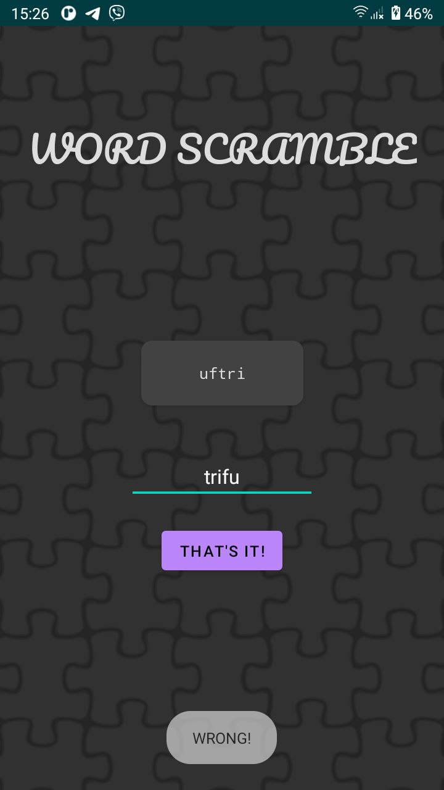

# Друга лабораторна робота

## Завдання №1

Знімок створеного в результаті виконання першого завдання вікна:

  

## Завдання №2

Знімки створеного в результаті виконання другого завдання вікна:

  

  

