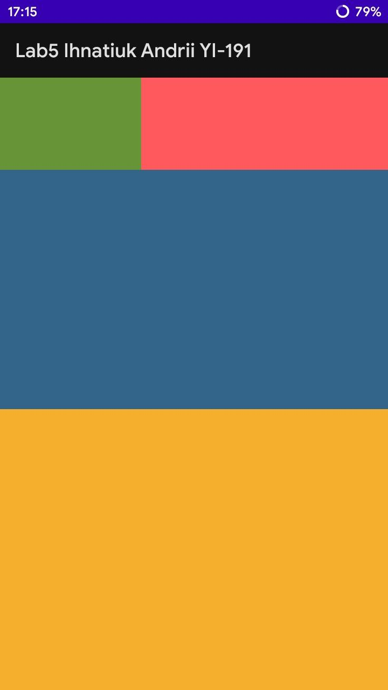
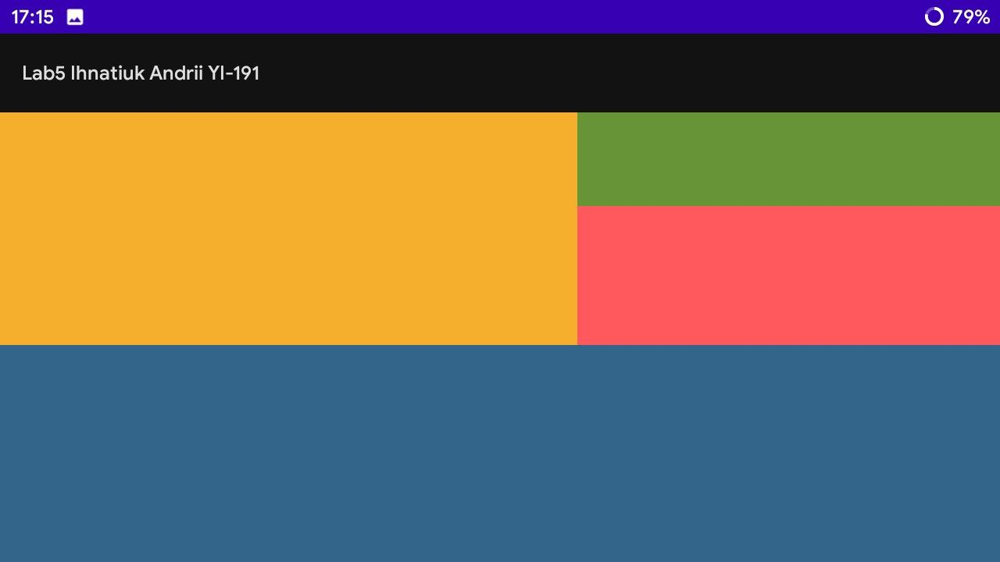
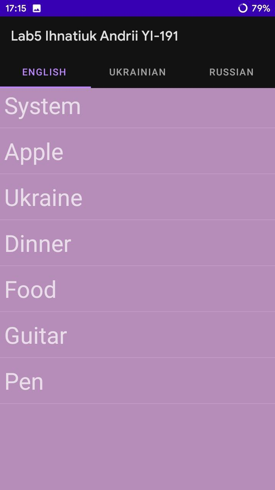
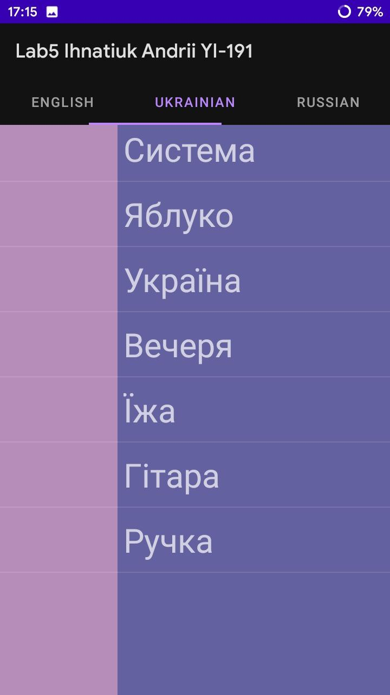
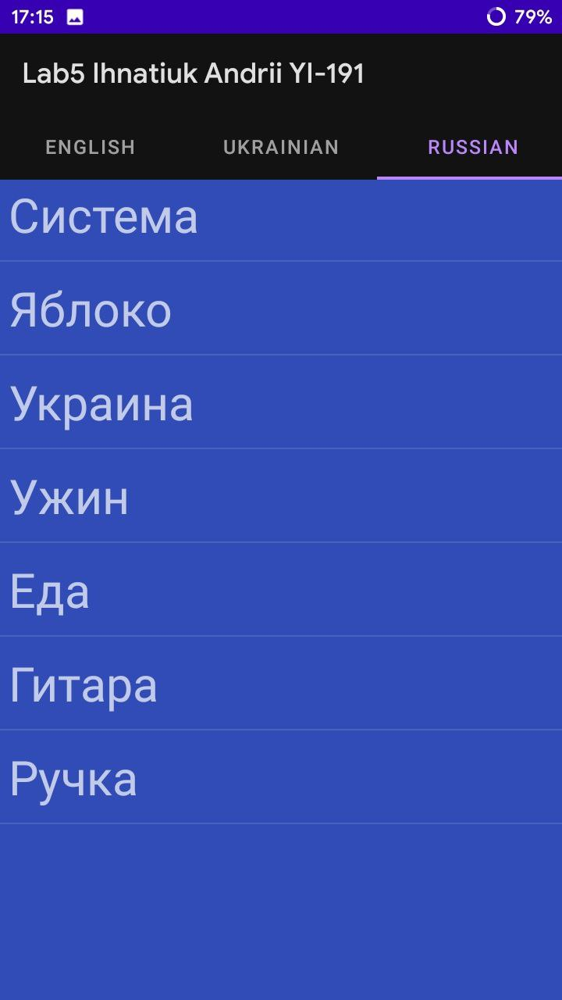

# П'ята лабораторна робота

## Перше завдання

Вигляд головного вікна програми. Усього додано чотири фрагменти:

  

Вікно програми після обертання экрану. Бачимо що layout змінено та фрагменти розташовані інакше:

  

## Друге завдання

Тут можна бачити елементи ViewPager2 разом з TabLayout. У самому фрагменті ініційовано елемент ListView, який статично заповнено даними, отриманими з файлу ресурсів. 

  

Для кожного фрагмента окремий string-array у файлі ресурсів.

  

Остання вкладка TabLayout.

  

