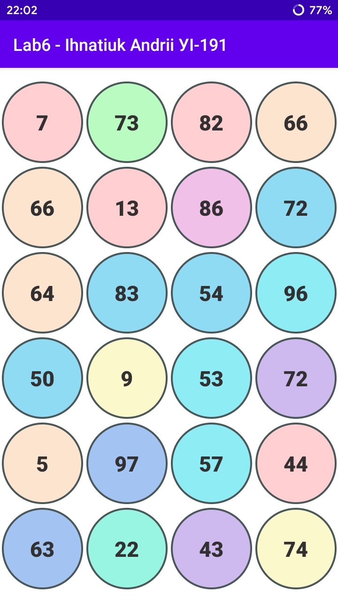
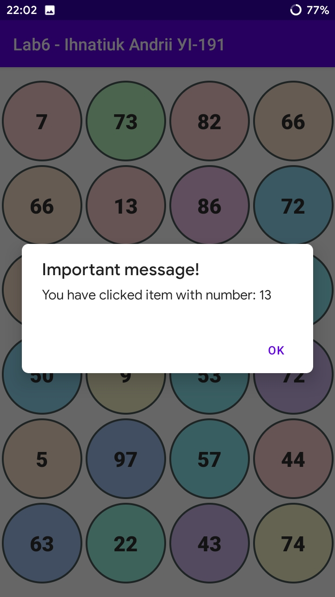

# П'ята лабораторна робота

## Результат виконання

Вигляд головного вікна програми. Величина масиву чисел розраховується відповідно до розмірів дисплею у dp та враховуючи розмір одного елемента списку.

  

Після натискання на елемент списку запускається діалогове вікно з повідомленням про число, яке міститься у TextView даного елемента списку.

  

Натиснули на ще один елемент.

  

