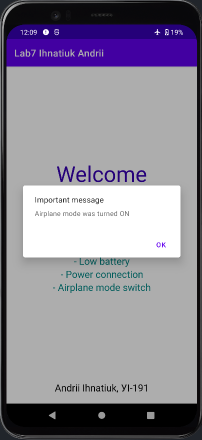

# Сьома лабораторна робота

## Результат виконання

Головне вікно програми:

  

Надсилання сповіщення про низький рівень заряду акумулятора а також створення діалогового вікна з тим самим повідомленням: 

  

Надсилання сповіщення про під'єднання джерела енергії а також створення діалогового вікна з тим самим повідомленням: 

  

Надсилання сповіщення та створення діалогу в результаті увімкнення режиму польоту:

  
  

Надсилання сповіщення та створення діалогу в результаті вимкнення режиму польоту:

  
  

